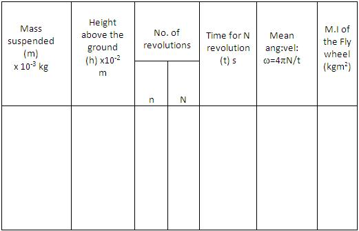

# Procedure

## Apparatus:

Fly wheel, weight hanger, slotted weights, stop watch, metre scale.

## Procedure for doing Simulator
#### Step 1: Select the Environment
1. Click the **Choose Environment** dropdown menu.
2. Select the desired environment (e.g., **Earth, g = 9.8 m/s²**).

> **Note:** Use **Earth** for the initial experiment. Later, repeat the experiment with other environments (such as the Moon or Mars) to observe the effect of gravity.

#### Step 2: Set the Flywheel Parameters
Use the sliders under the **VARIABLES** section to configure the experiment.

- **Mass of Flywheel (M)**
- **Diameter of Flywheel (D)**
- **Mass of Hanging Weight (m)**
- **Diameter of Axle (d)**
- **Number of Wounds of Chord (N₁)**

> **Note:** Keep the flywheel parameters constant during the first trial. Change only one parameter at a time in subsequent trials.

#### Step 3: Start the Experiment
1. Click **RELEASE FLY WHEEL**.
2. Observe the following:
   - The hanging weight descends and rotates the flywheel.
   - The cord slips off the axle after unwinding.
   - The flywheel continues rotating due to inertia and gradually comes to rest because of friction.

#### Step 4: Record the Observations
After the flywheel stops:

1. Record the **Number of Revolutions (N₂)** displayed near the axle.
2. Record the **Time (t)** shown on the digital stopwatch.

#### Step 5: Repeat the Experiment
1. Change one or more input parameters.
2. Repeat the experiment.
3. Record the observations for each trial.
4. Compare the results for different values of mass, dimensions, or gravitational environment.

## Procedure for doing Real Lab

1. The length of the cord is carefully adjusted, so that when the weight-hanger just touches the ground,the loop slips off the peg.
2. A suitable weight is placed in the weight hanger
3. A chalk mark is made on the rim so that it is against the pointer when the weight hanger just touches the ground.
4. The other end of the cord is loosely looped around the peg keeping the weight hanger just touching the ground.
5. The flywheel is given a suitable number (n) of rotation so that the cord is wound round the axle without overlapping.
6. The height (h) of the weight hanger from the ground is measured.
7. The flywheel is released.
8. The weight hanger descends and the flywheel rotates.
9. The cord slips off from the peg when the weight hanger just touches the ground.By this time the flywheel would have made n rotations.
10. A stop clock is started just when the weight hanger touches the ground.
11. The time taken by the flywheel to come to a stop is determined as t seconds.
12. The number of rotations (N) made by the flywheel during this interval is counted.
13. The experiment is repeated by changing the value of n and m.
14. From these values the moment of inertia of the flywheel is calculated using equation

$$I=\frac{Nm}{N+n}\left[ \frac{2gh}{\omega^{2}}-r^{2} \right]$$

## Observations

Mean value of moment of inertia,I =.........kgm2

## Result
Moment of inertia of the fly wheel =.........kgm2
