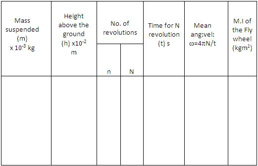

### Procedure

### Apparatus:

Fly wheel, weight hanger, slotted weights, stop watch, metre scale.

### Procedure for doing Simulator
1. Choose any desired environment by clicking on the “combo box".
2. Adjust the sliders to have suitable dimensions for flywheel arrangement.
3. Click on “Release fly wheel" to start the experiment.
4. No of revolutions (N) of the flywheel, after the loop slips off from peg is indicated on the side of axle.
5. The time taken by flywheel to come to rest is noted from stop watch.
6. Repeat the experiment for different values of variables.

### Procedure for doing Real Lab

1. The length of the cord is carefully adjusted, so that when the weight-hanger just touches the ground,the loop slips off the peg.
2. A suitable weight is placed in the weight hanger
3. A chalk mark is made on the rim so that it is against the pointer when the weight hanger just touches the ground.
4. The other end of the cord is loosely looped around the peg keeping the weight hanger just touching the ground.
5. The flywheel is given a suitable number (n) of rotation so that the cord is wound round the axle without overlapping.
6. The height (h) of the weight hanger from the ground is measured.
7. The flywheel is released.
8. The weight hanger descends and the flywheel rotates.
9. The cord slips off from the peg when the weight hanger just touches the ground.By this time the flywheel would have made n rotations.
10. A stop clock is started just when the weight hanger touches the ground.
11. The time taken by the flywheel to come to a stop is determined as t seconds.
12. The number of rotations (N) made by the flywheel during this interval is counted.
13. The experiment is repeated by changing the value of n and m.
14. From these values the moment of inertia of the flywheel is calculated using equation

$$I=\frac{Nm}{N+n}\left[ \frac{2gh}{\omega^{2}}-r^{2} \right]$$

### Observations

Mean value of moment of inertia,I =.........kgm2

## Result
Moment of inertia of the fly wheel =.........kgm2
